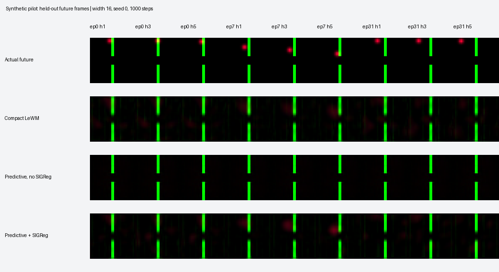

# Synthetic predictive-bottleneck pilot

Not the published TwoRoom benchmark. Small CNN, upstream transformer/SIGReg; 256 training and 64 held-out synthetic episodes; updates per run: [1000].

Initialization seeds: [0, 1, 2]. Values are mean ± sample standard deviation across initialization seeds. Lower errors are better. State is used only for diagnostic probes.

| Width | Variant | Future image MSE | Position probe MSE | Latent variance |
|---|---|---|---|---|
| 16 | compact_lewm | 0.001134 ± 0.0002 | 0.02079 ± 0.0043 | 13.47 ± 0.21 |
| 16 | compact_low_beta | 0.001054 ± 0.0002 | 0.08117 ± 0.03 | 14.03 ± 0.17 |
| 16 | predictive | 0.001216 ± 7.5e-06 | 0.2318 ± 0.014 | 1.398e-05 ± 1.4e-06 |
| 16 | predictive_sigreg | 0.0009338 ± 0.00011 | 0.08513 ± 0.031 | 14.05 ± 0.17 |
| 32 | compact_lewm | 0.00113 ± 0.00016 | 0.00463 ± 0.0016 | 27.67 ± 0.27 |
| 32 | compact_low_beta | 0.001027 ± 0.00015 | 0.02809 ± 0.0057 | 28.27 ± 0.38 |
| 32 | predictive | 0.001225 ± 8.7e-06 | 0.2085 ± 0.0054 | 2.267e-05 ± 1.1e-06 |
| 32 | predictive_sigreg | 0.0008483 ± 5.9e-05 | 0.02671 ± 0.0052 | 28.35 ± 0.37 |

Training-mean image baseline MSE: 0.00118738. Last-frame persistence MSE: 0.00141741.

The no-SIGReg variant shows very small latent variance and poor position probes. Low whole-image error alone does not establish useful dynamics. Effective rank must be interpreted alongside absolute variance.

The baseline decoder is trained on detached forecasts, with separately clipped gradients. compact_low_beta controls for the latent coefficient change from 1 to 0.1. All models use the same data and minibatch schedules. The synthetic encoder/projector uses LayerNorm and reduced hidden capacity; the full experiment retains the upstream ViT and BatchNorm projectors. These are pipeline findings, not a claim about LeWM benchmark performance.

analyzed.json includes each seed, training cost, rank, constant-image control, action-shuffle sensitivity, and zero-ablation of the least-variable quarter of input features. Ablation is coordinate-dependent and is not evidence of a uniquely meaningful subspace. No planning-success result has been measured.

Mean increase in observation MSE after shuffling actions between held-out episodes:

- compact_lewm: 0.000413658
- compact_low_beta: 0.000503797
- predictive: 9.70128e-11
- predictive_sigreg: 0.00057408

