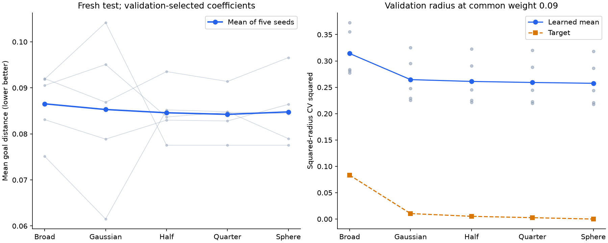
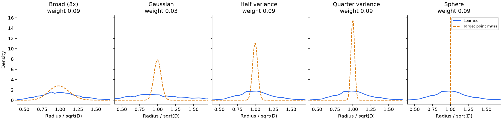

# Radial shape sweep

**Synthetic pilot, not published LeWM/TwoRoom.**

Validation selected Broad (8x) as the primary target; its fresh-test distance difference from Gaussian is +0.00123 (paired 95% interval [-0.00711, +0.00836]).

75 training runs; 1000 updates; seeds [13, 14, 15, 16, 17]. Five targets each received the same coefficient grid 0.03, 0.09, 0.27. Coefficients and the primary target were chosen by validation planning distance before evaluating fresh test data seed 60000.

## Selected-coefficient test results

Mean +/- sample standard deviation across training seeds. Lower distance is better.

| Target | Weight | Goal distance | Success | Effective rank |
|---|---|---|---|---|
| Broad (8x) | 0.09 | 0.08653 +/- 0.00736 | 75.8% +/- 5.4 pp | 13.93 |
| Gaussian | 0.03 | 0.08530 +/- 0.01630 | 79.2% +/- 11.4 pp | 8.46 |
| Half variance | 0.09 | 0.08459 +/- 0.00578 | 78.3% +/- 6.8 pp | 14.09 |
| Quarter variance | 0.09 | 0.08424 +/- 0.00497 | 77.5% +/- 7.0 pp | 14.10 |
| Sphere | 0.09 | 0.08478 +/- 0.00756 | 76.7% +/- 7.0 pp | 14.10 |

## Did training produce the target shapes?

Squared-radius CV^2 = Var(||z||^2) / E[||z||^2]^2. This removes overall scale without whitening or changing coordinates. Raw radius is about the prescribed zero origin; centered CV^2 is also reported. A perfect spherical target has CV^2=0. Mean squared radius / D should be 1 for every target.

| Target | Target CV^2 | Learned CV^2 | Centered CV^2 | Mean squared radius / D |
|---|---|---|---|---|
| Broad (8x) | 0.083333 | 0.302855 | 0.296741 | 1.0853 |
| Gaussian | 0.010417 | 0.546972 | 0.527736 | 1.2035 |
| Half variance | 0.005208 | 0.248448 | 0.243463 | 1.0843 |
| Quarter variance | 0.002604 | 0.246486 | 0.241600 | 1.0842 |
| Sphere | 0.000000 | 0.244936 | 0.239970 | 1.0842 |

Selected coefficients can differ, so the table above does not isolate the effect of shape at fixed loss strength. The following comparison uses validation embeddings at the common coefficient 0.09 for every target (not additional test-set selection).

| Target | Target CV^2 | Validation learned CV^2 at weight 0.09 |
|---|---|---|
| Broad (8x) | 0.083333 | 0.314144 |
| Gaussian | 0.010417 | 0.264571 |
| Half variance | 0.005208 | 0.261125 |
| Quarter variance | 0.002604 | 0.259136 |
| Sphere | 0.000000 | 0.257570 |

At this common weight, sphere versus Gaussian changes mean learned CV^2 by -2.65%. The sphere target is zero. Compare the gap to the target before interpreting a performance tie as evidence that different exact shapes are equally good.

Histograms use raw ||z||/sqrt(D), pooled across models and frames for visualization only. The sphere's target is a point mass at 1. Histogram range is [0,3]; raw moments and quantiles include all observations.

## Target distinguishability under the current regularizer

All targets are isotropic with covariance I. Squared radius follows Gamma(D/(2v), scale=2v), except v=0 (fixed radius). The target-only kernel distance integrates squared characteristic-function differences from Gaussian using the unchanged 17-point SIGReg grid and weights. This is a population separation diagnostic, not the noisy minibatch loss or a significance test.

| Target | Max projected CF difference from Gaussian | Kernel distance | Scaled by batch 64 |
|---|---|---|---|
| Broad (8x) | 0.0193054 | 0.000148453 | 0.00950097 |
| Gaussian | 0 | 0 | 0 |
| Half variance | 0.00141247 | 7.96412e-07 | 5.09704e-05 |
| Quarter variance | 0.00212038 | 1.79493e-06 | 0.000114876 |
| Sphere | 0.00282937 | 3.19636e-06 | 0.000204567 |

## Paired test distance differences from Gaussian

Negative favors the alternative. 20,000 paired seed bootstrap resamples, RNG 20260912. Intervals condition on these data and selected coefficients; they exclude tuning uncertainty. Five seeds are a small sample. Comparisons other than the validation-selected primary target are exploratory, with no multiple-comparison correction.

| Target | Mean difference | 95% seed bootstrap interval |
|---|---|---|
| Broad (8x) | +0.00123 | [-0.00711, +0.00836] |
| Gaussian | +0.00000 | [+0.00000, +0.00000] |
| Half variance | -0.00071 | [-0.01658, +0.01328] |
| Quarter variance | -0.00105 | [-0.01666, +0.01282] |
| Sphere | -0.00052 | [-0.01618, +0.01238] |

## Full validation grid

| Target | Weight | Mean distance | Mean success | Mean radial CV^2 |
|---|---|---|---|---|
| Broad (8x) | 0.03 | 0.08869 | 75.0% | 0.618747 |
| Broad (8x) | 0.09 | 0.07983 | 85.8% | 0.314144 |
| Broad (8x) | 0.27 | 0.09623 | 69.2% | 0.170432 |
| Gaussian | 0.03 | 0.08207 | 79.2% | 0.547527 |
| Gaussian | 0.09 | 0.08309 | 80.0% | 0.264571 |
| Gaussian | 0.27 | 0.09711 | 70.0% | 0.127492 |
| Half variance | 0.03 | 0.08328 | 79.2% | 0.543274 |
| Half variance | 0.09 | 0.08171 | 81.7% | 0.261125 |
| Half variance | 0.27 | 0.09448 | 72.5% | 0.124601 |
| Quarter variance | 0.03 | 0.08470 | 78.3% | 0.540587 |
| Quarter variance | 0.09 | 0.08221 | 81.7% | 0.259136 |
| Quarter variance | 0.27 | 0.09524 | 72.5% | 0.123108 |
| Sphere | 0.03 | 0.08483 | 77.5% | 0.538295 |
| Sphere | 0.09 | 0.08421 | 80.8% | 0.257570 |
| Sphere | 0.27 | 0.09539 | 72.5% | 0.121780 |

## Protocol and limitations

Fixed 529,790-parameter CNN/JEPA, latent width 192, original one-step loss, no decoder and no explicit radius loss. Same initialization and minibatches across targets per seed. AdamW lr 5e-4, decay 1e-3, batch 64, gradient clipping 1. Train 256 episodes (seed 12000), validation 128 (24000), fresh test 128 (60000). Five-step CEM, 64 candidates, two rounds, eight elites, same 24 goals for every model. Success threshold 0.12. Simulator state scores plans, never trains the model.

Each target has equal coefficient budget, but selecting among four alternatives has greater total search budget than Gaussian alone. Test rankings do not choose a new winner. Generalization across datasets, longer training, and the full LeWM benchmark remain untested. A target tying or winning while its learned radial distribution fails to approach that target does not identify an optimal shape.

Training source commit: `ea4609d500e6fb61b2797fe29836c4d5494c9134`. SciPy 1.18.1 used for target construction and this report. Raw per-goal metrics, histograms, quantiles and source hashes are in results.json; derived contrasts and target CFs are in analysis.json.

[Protocol and derivation](../../RADIAL_STUDY.md). Mathematical references: [NIST 1F1 series](https://dlmf.nist.gov/13.2) and [SciPy 0F1](https://docs.scipy.org/doc/scipy/reference/generated/scipy.special.hyp0f1.html).
