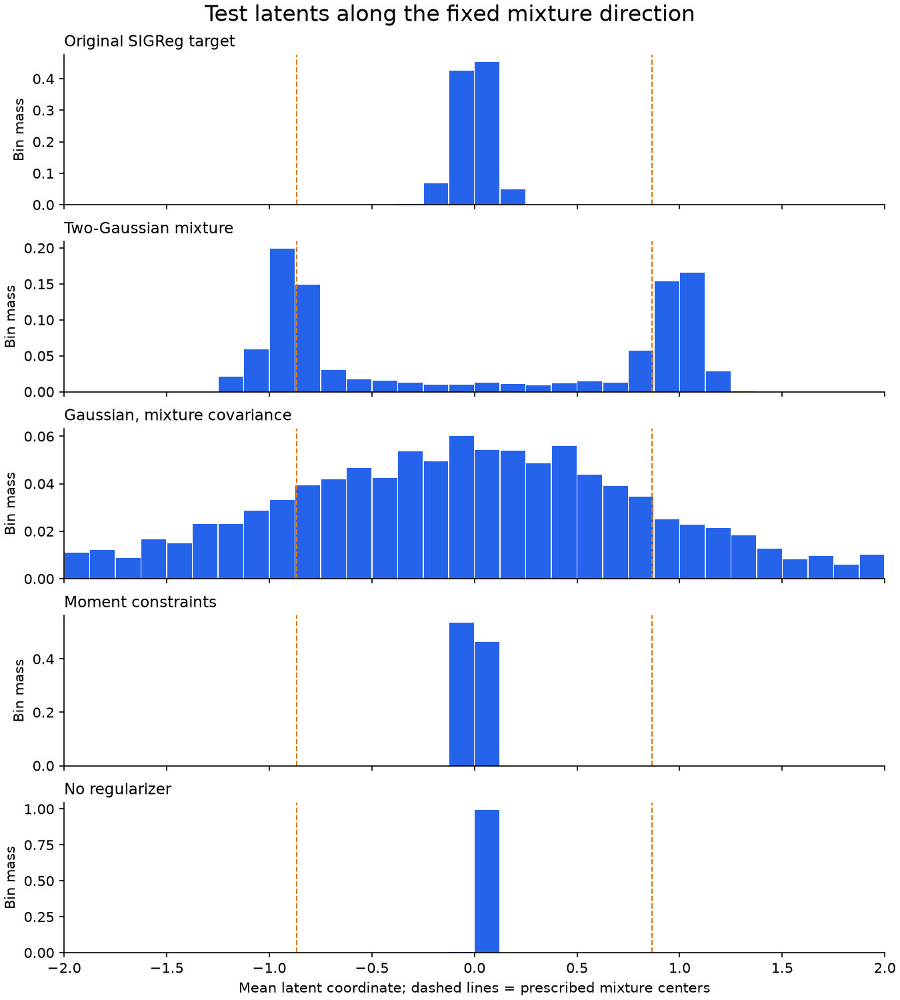

# Direct regularizer comparison

**Scope: synthetic pilot, not the published LeWM/TwoRoom benchmark.** All arms have the same 529,790-parameter model and 192-dimensional latent. There is no decoder, reconstruction loss, or change in latent-loss weight.

Completed 39 training runs, each with 1000 updates. One coefficient per family was chosen by mean validation planning distance across 3 initialization seeds, then evaluated on separate test trajectories. The table reports mean ± sample standard deviation across those seeds.

| Regularizer | Selected weight | Test goal distance ↓ | Test success ↑ | Position probe MSE ↓ | Latent variance | Effective rank |
|---|---|---|---|---|---|---|
| Original SIGReg target | 0.09 | 0.07654 ± 0.016 | 81.94 ± 15% | 0.00102 ± 0.00029 | 205.6 ± 8.5 | 14.12 ± 0.26 |
| Two-Gaussian mixture | 0.27 | 0.1222 ± 0.01 | 65.28 ± 6.4% | 0.001418 ± 0.00053 | 192.6 ± 3.8 | 2.889 ± 0.038 |
| Gaussian, mixture covariance | 0.09 | 0.116 ± 0.022 | 59.72 ± 8.7% | 0.0008103 ± 0.00013 | 195.8 ± 16 | 2.42 ± 0.085 |
| Moment constraints | 0.3 | 0.1262 ± 0.013 | 56.94 ± 2.4% | 0.003975 ± 0.00033 | 23.56 ± 0.18 | 31.51 ± 0.85 |
| No regularizer | 0.0 | 0.4521 ± 0.049 | 1.389 ± 2.4% | 0.2671 ± 0.078 | 0.001763 ± 0.00052 | 34.53 ± 2.6 |

Test controls: staying still gives mean goal distance 0.3316; a fixed random-action plan gives 0.3295.

## What changes, and what stays fixed

SIGReg's estimator, random unit projections, frequency grid and quadrature weights are unchanged for the three distribution-target arms. Only the analytical target characteristic function changes. Tests verify the Gaussian arm exactly equals upstream SIGReg.

The mixture is ½ N(+m, 0.25 I) + ½ N(−m, 0.25 I), with each m coordinate √0.75. Every coordinate has zero mean and unit marginal variance, but covariance is 0.25 I + m mᵀ. The matched Gaussian has that same covariance and a single mode. This control distinguishes mode structure from changed covariance/goal geometry.

A fixed mixture is an alternative prescribed shape, not a superset of the Gaussian constraint. The moment arm is the genuinely broader distribution family: it anchors the mean, penalizes standard deviations below one, and penalizes off-diagonal covariance without prescribing higher moments or the number of modes.

CF-target weights: 0.03, 0.09, 0.27. Moment weights: 0.3, 3, 30 because its loss has a different numerical scale. These are small, predefined searches, not proof of optimal tuning for any arm. The relative weights inside the moment penalty were not tuned; finite-batch covariance penalties can trade against its soft variance floor. The no-regularizer control has weight zero.

## Model, data and evaluation

A small CNN replaces the ViT. The predictor has two transformer blocks, hidden width 64, four heads, and MLP width 128. Latents and action embeddings are 192-wide; projectors use BatchNorm like upstream. AdamW uses lr 5e-4, weight decay 1e-3, batch size 64, gradient clipping 1. All training uses the original four-frame one-step latent objective. No simulator state enters the training loss.

256 training episodes (data seed 12000), 128 validation episodes (24000), 128 final test episodes (36000). Model initialization seeds are 0, 1, 2. Minibatch schedules are identical across arms within each seed. Probes are fit on training latents and evaluated on held-out latents; they are diagnostics only.

Planning uses 24 fixed nontrivial episodes per split, horizon five, 64 candidates, two CEM iterations, eight elites, and Euclidean terminal latent distance. The model selects the plan; simulator state is used only to score its execution. Success means terminal distance below 0.12. A known-dynamics unit test checks that the planner improves on random actions and staying still.

These are short, open-loop synthetic control problems, not navigation benchmark success or closed-loop MPC. Seed variation and only 24 test goals limit precision; the same goals are reused across model seeds, so they are not 72 independent tasks. Test per-episode distances and all validation outcomes are in results.json.

## Does the mixture form modes?

The histogram axis is the average latent coordinate, aligned with the fixed mixture's mean direction. Its prescribed centers are ±√0.75. This axis has no assumed physical meaning. Balanced positive/negative counts alone do not establish bimodality. The other arms need not populate this arbitrarily chosen direction.

The full ViT/model configuration is config/train/regularizer_study.yaml. Published-data training and benchmark evaluation remain outstanding.
