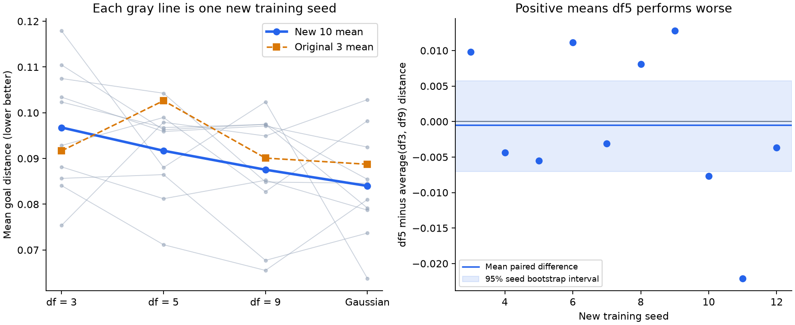

# Student-t: ten new training seeds

The new seeds do not establish a reproducible df5 distance dip.

Fixed coefficient 0.09; four targets; 1,000 updates; seeds 3 through 12. 40 new runs. Same model, data and 24 planning goals as the original sweep. No hyperparameter or target selection in this replication.

## Primary replication results

Mean +/- sample standard deviation across the ten new training seeds.

| Target | Goal distance (lower better) | Success | Latent variance | Projection second moment |
|---|---|---|---|---|
| df = 3 | 0.09677 +/- 0.01356 | 72.1% +/- 9.2 pp | 134.1 | 0.727 |
| df = 5 | 0.09170 +/- 0.00993 | 76.3% +/- 8.1 pp | 180.5 | 0.972 |
| df = 9 | 0.08755 +/- 0.01280 | 76.7% +/- 9.0 pp | 194.7 | 1.045 |
| Gaussian | 0.08400 +/- 0.01159 | 80.0% +/- 8.5 pp | 201.3 | 1.079 |

Primary contrast, df5 minus the average of df3 and df9: **-0.00046**, paired seed bootstrap 95% interval **[-0.00701, +0.00572]**. Positive in 4/10 seeds. Positive means df5 is worse.

## Paired distance contrasts

| Contrast | Mean difference | Bootstrap 95% interval | Positive seeds |
|---|---|---|---|
| df5 minus mean(df3, df9) | -0.00046 | [-0.00701, +0.00572] | 4/10 |
| df = 3 minus Gaussian | +0.01277 | [+0.00008, +0.02524] | 8/10 |
| df = 5 minus Gaussian | +0.00770 | [+0.00108, +0.01417] | 8/10 |
| df = 9 minus Gaussian | +0.00354 | [-0.00565, +0.01383] | 6/10 |
| df5 minus df3 | -0.00507 | [-0.01294, +0.00310] | 3/10 |
| df5 minus df9 | +0.00415 | [-0.00228, +0.01068] | 5/10 |

## Original versus replication

The original three seeds motivated this contrast. The pooled 13-seed result is descriptive; the ten new seeds above are the primary replication.

| Target | Original 3: distance / success | New 10: distance / success | Pooled 13: distance / success |
|---|---|---|---|
| df = 3 | 0.09167 / 72.2% | 0.09677 / 72.1% | 0.09559 / 72.1% |
| df = 5 | 0.10264 / 65.3% | 0.09170 / 76.3% | 0.09422 / 73.7% |
| df = 9 | 0.09009 / 77.8% | 0.08755 / 76.7% | 0.08813 / 76.9% |
| Gaussian | 0.08874 / 75.0% | 0.08400 / 80.0% | 0.08509 / 78.8% |

## Scope and uncertainty

Intervals use 20,000 paired training-seed bootstrap resamples, RNG seed 20260912. Whole seeds are resampled, preserving pairing across targets and all goals within each run. They describe initialization/minibatch variability conditional on this fixed training data and already-inspected test split (seed 48000). They do not measure uncertainty across tasks or environments. Ten seeds remain a small sample.

Only the df5-versus-neighbors distance contrast is primary. Other intervals are descriptive and have no multiple-comparison correction. Threshold success is secondary and can rank targets differently from mean distance. No new claim about the best df should be selected from these results without another validation.

All targets have theoretical covariance I, but learned variance and tail fit can differ. This experiment does not separate shape from optimization effects. Synthetic CNN pilot only, not published LeWM/TwoRoom.

Training source commit: `9fef199c7f5dc1861b5b7706bf2db250696ba414`. Raw per-seed and per-goal measurements and source hashes are in results.json. Original data: ../student-t-study-1000/results.json.
