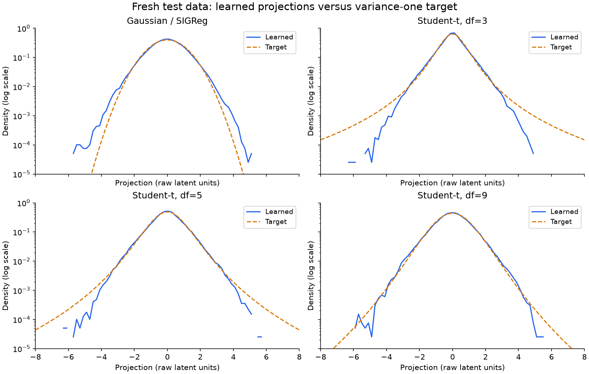

# Student-t versus Gaussian regularization

**Synthetic pilot, not a published TwoRoom benchmark.** Fixed 529,790-parameter model, 192-dimensional latent, original one-step latent loss, no decoder. The only training changes are the distribution target and its coefficient.

36 training runs, 1000 updates each. Seeds: [0, 1, 2]. Coefficients 0.03, 0.09, 0.27 were compared for every target.

Validation selected **Student-t, df=9** as the primary Student-t candidate before opening the final test split. Its search has nine df/weight combinations, versus three weights for Gaussian; the independent test limits selection optimism but does not make those search budgets equal.

Each table entry is mean ± sample standard deviation across model seeds. The same 24 test goals are reused across seeds, not 72 independent tasks.

| Target | Selected weight | Test goal distance ↓ | Test success ↑ | Position probe MSE ↓ | Latent variance | Effective rank |
|---|---|---|---|---|---|---|
| Gaussian / SIGReg | 0.09 | 0.08874 ± 0.0075 | 75 ± 8.3% | 0.0009387 ± 0.00029 | 196.4 ± 8.5 | 14.35 ± 0.35 |
| Student-t, df=3 | 0.09 | 0.09167 ± 0.021 | 72.22 ± 13% | 0.001366 ± 0.00043 | 127.7 ± 0.25 | 13.45 ± 0.72 |
| Student-t, df=5 | 0.09 | 0.1026 ± 0.0035 | 65.28 ± 8.7% | 0.001055 ± 0.00018 | 173.4 ± 3.9 | 13.72 ± 0.54 |
| Student-t, df=9 | 0.09 | 0.09009 ± 0.0091 | 77.78 ± 8.7% | 0.0009767 ± 0.00018 | 189 ± 6.3 | 14.01 ± 0.41 |

Final test controls: stay-put distance 0.3597; random-plan distance 0.3872.

## Target and implementation

Each Student-t is a spherical multivariate distribution: X = G sqrt((ν−2)/U), where G ~ N(0,I) and U ~ chi-square(ν), with one shared U per vector. The mean is zero and covariance is identity for all tested ν. This changes higher-order shape without prescribing the correlated covariance of the previous mixture. It is not a product of independent univariate t distributions.

SIGReg's random directions, 17 frequency points, 64 pilot projections, integration weights and Gaussian frequency window remain unchanged. Exact Student-t target characteristic functions are precomputed using exponential-polynomial formulas for ν=3,5,9. No target samples are drawn during training. Numerical tests compare these formulas with independent multivariate Student-t samples and verify unit variance.

Matching target covariance does not guarantee matching learned covariance: these are soft finite-projection losses trained for a limited budget. The target latent variance trace is 192; compare it with actual variance in the table. ν=3 has no finite fourth moment, so sample kurtosis is not a reliable pass/fail criterion.

## Tail diagnostics

These plots pool fixed random projections of test embeddings without whitening or rescaling them. Dashed curves are variance-one target densities. Counts include correlated projections and adjacent frames; they are visualization data, not independent statistical trials. The displayed range is limited to [−8,8].

| Target | Mean projection second moment | Fraction with abs(projection)>3 | Fraction >5 |
|---|---|---|---|
| Gaussian / SIGReg | 1.052 | 0.7390% | 0.0076% |
| Student-t, df=3 | 0.6841 | 0.4801% | 0.0061% |
| Student-t, df=5 | 0.931 | 0.8926% | 0.0132% |
| Student-t, df=9 | 1.016 | 0.9196% | 0.0117% |

## Protocol and limits

Train: 256 episodes, data seed 12000. Validation: 128 episodes, seed 24000. Final test: 128 episodes, **fresh seed 48000**, replacing the previously inspected 36000 test split. Results therefore should not be compared numerically to the earlier mixture table; the Gaussian baseline was rerun here on the same new test set.

AdamW lr 5e-4, weight decay 1e-3, batch 64, clipping 1; identical initialization and minibatches across targets per seed. Small CNN, BatchNorm projectors, two-block hidden-64 predictor. No simulator state in training. Probes are fit on training latents for diagnostics only. Coefficients and primary Student-t df are selected by mean validation planning distance, never final-test performance.

All planning uses five-step open-loop CEM with Euclidean terminal latent distance, 64 candidates, two iterations, eight elites and 24 fixed nontrivial goals. Success is terminal position distance below 0.12. The initial goal distance must exceed 0.2. Simulator state scores the selected plan but is not provided to the planner.

This tests these fixed Student-t targets on short synthetic dynamics, not all heavy-tailed priors or full LeWM benchmark performance. Tail relaxation is not a reduction in dense-network computation. Longer runs, more seeds and actual benchmark datasets remain separate work.

Mathematical references: [SciPy multivariate-t parameterization](https://docs.scipy.org/doc/scipy/reference/generated/scipy.stats.multivariate_t.html) and [NIST half-integer Bessel formulas](https://dlmf.nist.gov/10.49).
