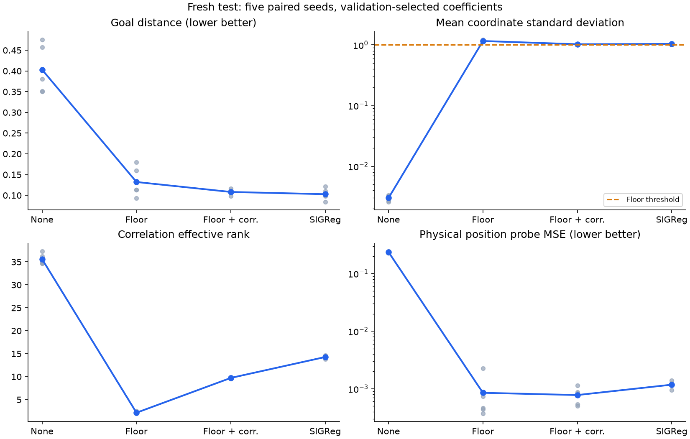

# Variance floor versus SIGReg

**Synthetic pilot, not published LeWM/TwoRoom.**

50 runs, 1000 updates each, seeds [18, 19, 20, 21, 22]. Three coefficients per active regularizer, plus no-regularizer control. Each arm's coefficient was selected by mean validation planning distance before fresh test seed 72000 was opened.

## Planning and physical prediction

Mean +/- sample standard deviation across five training seeds. Lower errors are better.

| Arm | Weight | Goal distance | Success | Position probe MSE | Five-step position probe MSE |
|---|---|---|---|---|---|
| None | 0.0 | 0.40308 +/- 0.05971 | 5.8% +/- 2.3 pp | 0.23537 | 4.388 |
| Variance floor | 3.0 | 0.13214 +/- 0.03623 | 50.8% +/- 13.0 pp | 0.00085099 | 0.01295 |
| Floor + decorrelation | 0.3 | 0.10810 +/- 0.00657 | 65.0% +/- 7.0 pp | 0.00077756 | 0.010881 |
| SIGReg | 0.09 | 0.10273 +/- 0.01398 | 65.0% +/- 8.6 pp | 0.001177 | 0.024936 |

Controls: stay-put mean distance 0.31948; random plan 0.33481.

## Are dimensions active and distinct?

The floor threshold is std=1. We report the fraction reaching at least 0.9 as a practical near-floor diagnostic, not proof that the soft constraint is fully satisfied. Standard deviations and correlations pool test frames; timewise attainment is also saved in raw results.

| Arm | Mean coordinate std | Fraction std <0.1 | Fraction std >=0.9 | Total variance | Covariance effective rank | Correlation effective rank | Mean abs correlation | Top correlation eigenvalue share |
|---|---|---|---|---|---|---|---|---|
| None | 0.0030 | 100.0% | 0.0% | 0.0017927 | 33.64 | 35.60 | 0.1574 | 11.4% |
| Variance floor | 1.1604 | 0.0% | 100.0% | 259.62 | 2.12 | 2.15 | 0.6775 | 66.8% |
| Floor + decorrelation | 1.0270 | 0.0% | 98.3% | 203.18 | 9.61 | 9.73 | 0.2667 | 16.1% |
| SIGReg | 1.0397 | 0.0% | 76.6% | 214.07 | 13.68 | 14.28 | 0.2321 | 15.2% |

Effective rank is a relative eigenvalue-spread measure: high rank at nearly zero total variance still represents near-collapse. Conversely, high coordinate variance with low rank can indicate repeated signals. Neither statistic alone measures useful information; physical probes and planning are the outcome checks.

## Latent prediction diagnostics

Raw latent MSE can become tiny through collapse. The normalized metric divides by mean coordinate variance (clamped at 1e-8); interpret it with physical probes.

| Arm | Raw one-step MSE | Variance-normalized MSE | Action-shuffle five-step probe degradation | Mean-vector squared / D |
|---|---|---|---|---|
| None | 9.6798e-06 | 1.0618 | -0.0004451 | 0.0024055 |
| Variance floor | 0.0054563 | 0.0040005 | 0.075743 | 0.045903 |
| Floor + decorrelation | 0.023114 | 0.021849 | 0.07376 | 0.060692 |
| SIGReg | 0.042407 | 0.038056 | 0.078404 | 0.01345 |

## Paired goal-distance contrasts

Negative favors the first arm. 20,000 paired training-seed bootstrap resamples, RNG seed 20260912. Five seeds remain a small sample. Intervals condition on fixed data and selected coefficients; no dataset or search uncertainty is included. Only floor versus SIGReg is primary; other intervals are exploratory without multiple-comparison correction.

| Contrast | Mean difference | 95% seed bootstrap interval |
|---|---|---|
| Floor minus SIGReg (primary) | +0.02942 | [+0.00519, +0.05364] |
| Combined minus floor | -0.02405 | [-0.05215, -0.00054] |
| Combined minus SIGReg | +0.00537 | [-0.00692, +0.01867] |
| Floor minus none | -0.27093 | [-0.31511, -0.22486] |
| Combined minus none | -0.29498 | [-0.34144, -0.24852] |
| SIGReg minus none | -0.30035 | [-0.33985, -0.26085] |

## Full validation grid

| Arm | Weight | Goal distance | Success | Mean std | Correlation rank |
|---|---|---|---|---|---|
| None | 0.0 | 0.42604 | 3.3% | 0.0028 | 38.19 |
| Variance floor | 0.3 | 0.24284 | 26.7% | 1.0303 | 1.30 |
| Variance floor | 3.0 | 0.11154 | 61.7% | 1.0884 | 2.16 |
| Variance floor | 30.0 | 0.12670 | 50.0% | 1.1163 | 2.60 |
| Floor + decorrelation | 0.3 | 0.10853 | 70.8% | 1.0059 | 9.68 |
| Floor + decorrelation | 3.0 | 0.11229 | 64.2% | 1.0667 | 20.04 |
| Floor + decorrelation | 30.0 | 0.14344 | 43.3% | 1.1148 | 41.11 |
| SIGReg | 0.03 | 0.08326 | 83.3% | 1.0624 | 8.75 |
| SIGReg | 0.09 | 0.08142 | 80.8% | 1.0190 | 14.49 |
| SIGReg | 0.27 | 0.09270 | 75.8% | 0.9960 | 21.18 |

Grid-boundary selections: variance_decorrelation. Boundary choices limit claims about adequate tuning. Equal numbers of settings do not guarantee equally favorable ranges. The combined arm's internal correlation weight was fixed at 1 and was not separately tuned.

## Implementation and scope

Floor = mean(ReLU(1-sqrt(sample_variance+1e-4))^2), computed across batch separately per time. Combined adds mean squared off-diagonal sample correlation, normalized by D*(D-1), at relative weight 1. No mean anchor or upper variance bound. This differs from the earlier mean+floor+covariance MomentRegularizer. With batch 64 and width 192, zero sample correlation across all active dimensions is unattainable; decorrelation is a soft objective. Exact constant collapse is stationary for the floor; this tests prevention from random initialization.

Fixed 529,790-parameter CNN/JEPA, width 192, existing BatchNorm layers, original one-step latent prediction, no decoder. AdamW lr 5e-4, decay 1e-3, clipping 1, batch 64. Same initialization and minibatches per seed. SIGReg uses 64 projections and 17 frequencies. Train 256 episodes (12000), validation 128 (24000), test 128 (72000). Five-step CEM with 64 candidates, two iterations, eight elites. All models use the same 24 test goals. Success threshold 0.12. Simulator state is used for scoring and diagnostic probes, never as a training target.

Source commit `74d0a4ff4f6099b55647724db058e6ff4ca1538c`; source hashes and per-goal measurements in results.json. No full published benchmark or cross-dataset replication. [Frozen protocol](../../VARIANCE_STUDY.md).
